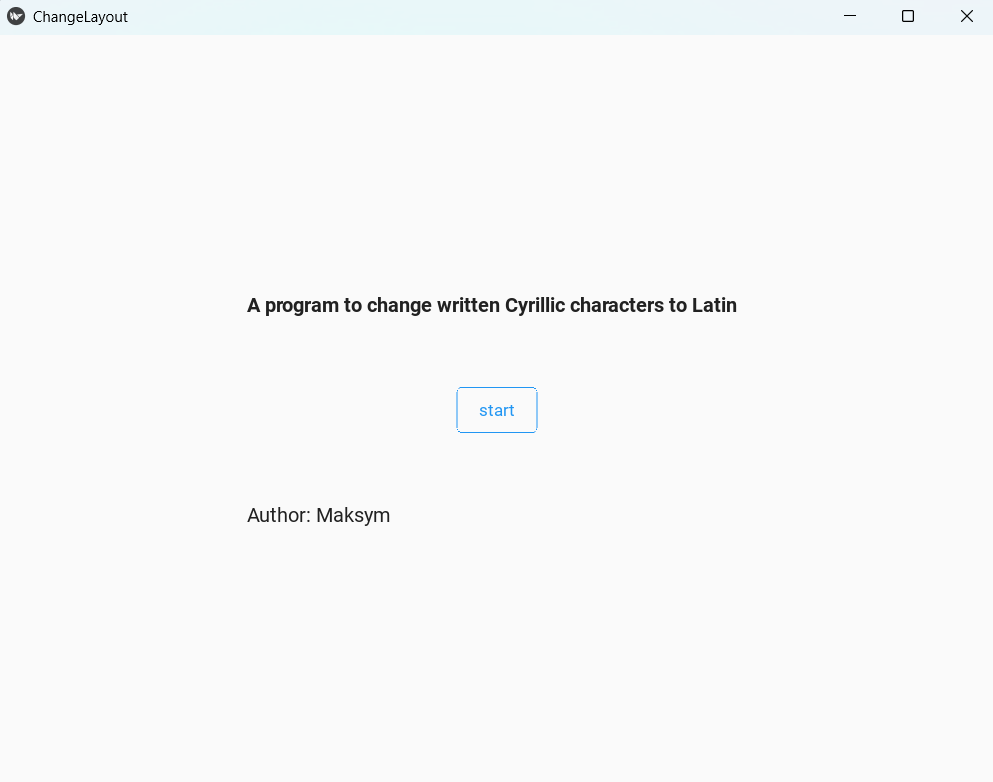
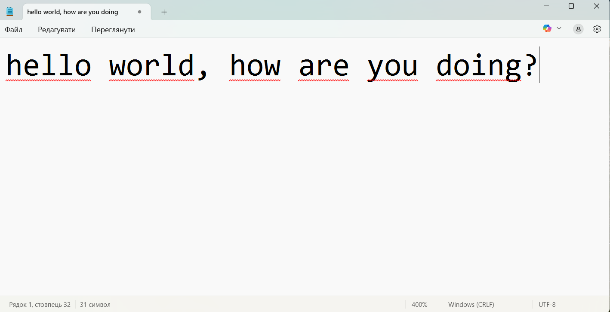

# 🔄 Change-of-Layout Tool

Have you ever typed a whole sentence and realized your keyboard layout was wrong?  
This simple Python tool helps **convert mistyped text** between English (QWERTY) and Ukrainian (ЙЦУКЕН) keyboard layouts — without retyping everything.

---

## 🚀 Features

- 🔁 Convert from Ukrainian to English layout
- 🖥️ Simple and fast: just paste and get corrected text
- ✅ Ideal for messengers, documents, and text editing

---

## 📸 Screenshots

| Screenshot | Description |
|------------|-------------|
|  | To use the app, start it as shown here. |
|  | Select the text written in Cyrillic to convert it. |
|  | Press Shift to switch the layout to Latin. |

---

## 🛠️ Tech Stack

- Python 3.10  
- keyboard
- pyperclip
- pyautogui
- kivymd

---

## 📂 How to Run

> Don't forget to add your TOKEN in main.py
```bash
git clone https://github.com/MaxImUm05-a/Change-of-layout.git
cd Change-of-layout
pip install -r requirements.txt
python gui.py
```
